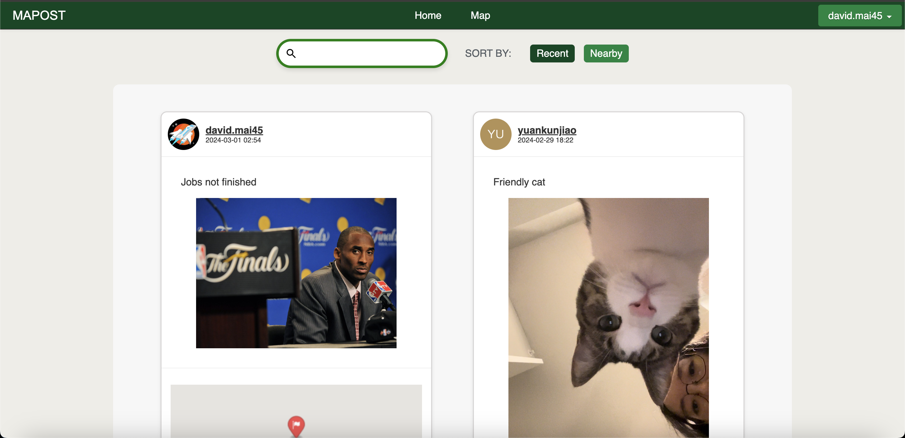
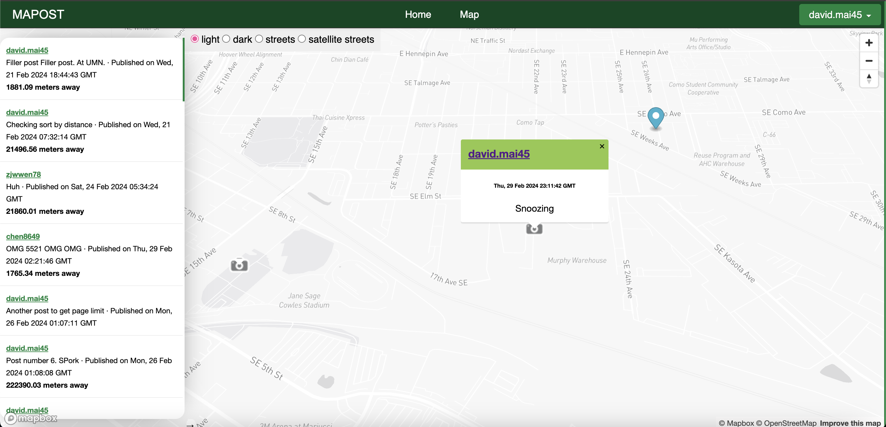
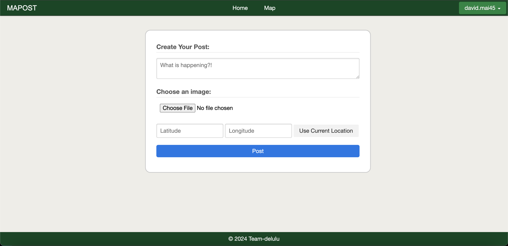
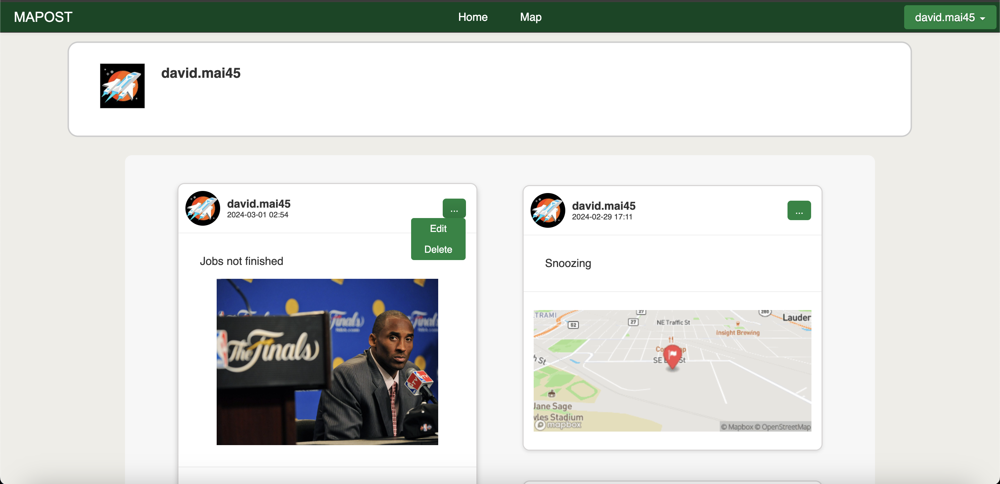

# MAPOST

The first of two open-ended projects where I worked in a team of six to build and deploy a full-stack application. The only strict requirements given were a provided tech stack and the goal for the app being to create and edit online content. The overall result for this project was an A :)

## Overview

MAPOST is a social platform with a focus on location and coordinates. The app provides both a standard and map feed (with [Mapbox](https://www.mapbox.com/)) to view posts from different users to play on the idea of location and coords. Other features include: provider logins, a dynamic search dropdown and autofill, persistent sorting using both time and location, image uploading, etc.  

The project was built using JavaScript and HTML/CSS for the front end, Python and Flask for the back end, [Auth0](https://auth0.com/) for authentication, and a PostgreSQL database. The app and database were previously hosted on [Render](https://render.com/).

## Screenshots

[Initial mockups](https://app.moqups.com/65yuGy0ywLlNvmH97f7BkrxYrhJ9mT42/view/page/a4dc19d87)

### Feed
One of two main ways to view posts. Includes a paginated feed with a search for text content and a recent/nearby sort.

### Map
One of two main ways to view posts. Includes 4 different map styles and an interactive sidebar feed to go to a post on the map. Has a marker showing current position.

### Create
Creation page for a user post. Includes text, image, and coordinate(number) input. Able to use current location to autofill coordinates.

### User
A user's page which shows a paginated feed of their posts ordered by recency. If it's your page, an additional button appears for edit and delete abilities.

